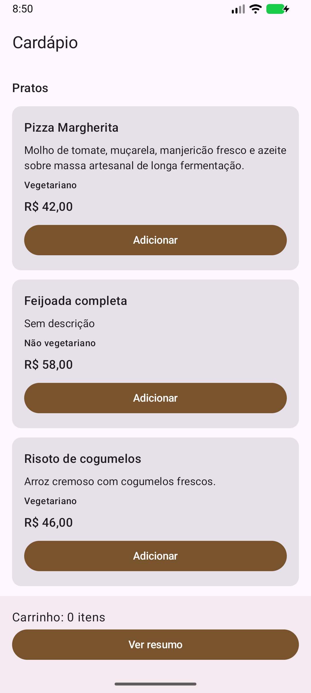
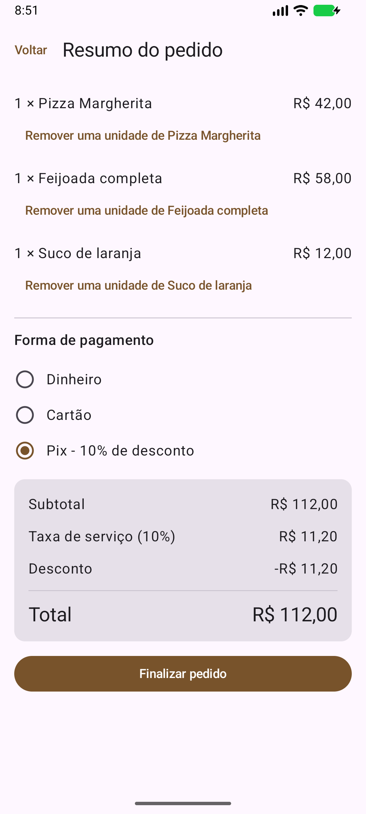
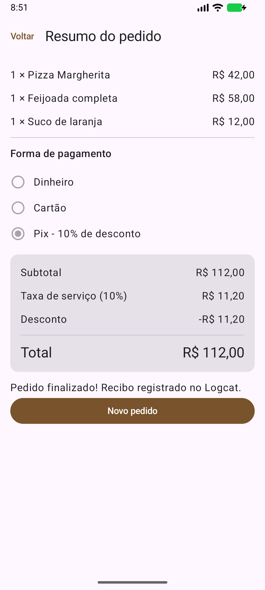

# Catálogo Interativo de Restaurante

Atividade de LDDM / PDMII: aplicativo Android nativo com cardápio, carrinho, pagamento e recibo digital.

## Grupo e responsabilidades

| Integrante | Camada | Arquivos principais |
|---|---|---|
| Brunin | A: modelagem e estrutura inicial | `model/Modelos.kt`, Gradle, manifesto e recursos |
| Leo | B: regras de negócio e estado | `domain/MotorPedido.kt`, `domain/PedidoViewModel.kt`, `MotorPedidoTest.kt` |
| Mauricio | C: catálogo e card reutilizável | `ui/CatalogoScreen.kt` |
| Brunão | D: resumo, pagamento e integração | `ui/ResumoScreen.kt`, `MainActivity.kt` |

Os arquivos Kotlin possuem comentários de início e fim identificando cada parte. Este é um material de implementação para o grupo revisar, testar e explicar. Os commits devem ser feitos pelos próprios integrantes, com suas contas e após a revisão da parte assumida.

## Referência e conhecimentos aplicados

Base consultada: [PDMII-MergeSkills-NativeAndroid](https://github.com/fatec-registro-yuri-villanova/PDMII-MergeSkills-NativeAndroid), commit `2b3f81a1970e94a083fdcf2cc0d2bdfcdd62daae`.

| Conteúdo da referência | Aplicação nesta atividade |
|---|---|
| `basics/FundamentosKotlin.kt`: tipos, null safety, funções e `when` | Modelos selados, descrição opcional, callbacks e avaliação exaustiva |
| `ui/screens/aula03/Aula03Screen.kt`: Compose e Material 3 | Scaffold, Cards, espaçamento e escala tipográfica |
| `ui/screens/aula04/Aula04Screen.kt`: navegação por callbacks | Alternância entre catálogo e resumo |
| `ui/screens/aula05/Aula05ViewModel.kt`: estado em ViewModel | Carrinho e pagamento preservados em rotação |
| Configuração Gradle e Compose | AGP 8.13.2, Kotlin 2.0.21, Gradle 8.13, BOM 2024.09.00 |

O projeto é independente do app de aulas. Usa Kotlin, Jetpack Compose, Material 3, ViewModel, Gradle e JUnit 4. Não precisa de backend. A navegação entre duas telas usa estado salvo; dados do pedido ficam no ViewModel. Ktor, autenticação e DataStore da referência não são necessários para este escopo.

Compatibilidade: [documentação oficial do AGP 8.13](https://developer.android.com/build/releases/agp-8-13-0-release-notes). Configure **JDK 17** no Gradle; compile/target SDK 36 e Android mínimo 7.0 (API 24).

## Abrir e executar

1. Abra esta pasta no Android Studio como projeto existente.
2. No SDK Manager, instale Android SDK Platform 36 e Build Tools 35.0.0, se solicitados.
3. Em Settings > Build, Execution, Deployment > Build Tools > Gradle, selecione JDK 17.
4. Sincronize o Gradle, selecione um emulador/dispositivo API 24 ou superior e execute `app`.
5. `local.properties` é específico de cada computador e não deve ser commitado. O Android Studio configura o caminho do SDK local.

No PowerShell, com `JAVA_HOME` apontando para JDK 17:

```powershell
.\gradlew.bat testDebugUnitTest assembleDebug
```

APK: `app/build/outputs/apk/debug/app-debug.apk`. Resultados JUnit: `app/build/reports/tests/testDebugUnitTest/index.html`.

## Arquitetura e regras

`Cardapio → CatalogoScreen → PedidoViewModel → MotorPedido → ResumoScreen`

- `ItemMenu` é uma classe selada com Prato e Bebida; os dados de exemplo ficam fora da renderização.
- `FormaPagamento` restringe as opções a Dinheiro, Cartão e Pix; Pix carrega o percentual.
- Dinheiro e cartão: subtotal + 10% de serviço. Pix: mesma taxa, menos o percentual de desconto sobre **o subtotal**.
- Dinheiro é representado em centavos (`Long`). Percentuais são arredondados para centavos com `HALF_UP`, após somar o subtotal.
- Cards recebem item e callback; resumo recebe itens, pagamento, opções e totais calculados pelo domínio.
- Adicionar novamente aumenta a quantidade. Remover reduz uma unidade; quantidade zero remove a linha.
- Todos os textos usam a tipografia Material 3. Nomes e descrições longos têm limite e reticências; descrição nula/vazia exibe "Sem descrição".
- Finalizar bloqueia alterações no pedido, mantém o recibo visível e imprime categorias no Logcat com a tag `CatalogoPedido`. Não realiza cobrança real.
- Carrinho vazio não pode ser finalizado. Novo pedido limpa itens e pagamento.
- O estado sobrevive a rotações, mas não ao encerramento do processo. Não há armazenamento de pedidos anteriores.

## Validação exigida

Adicione uma Pizza Margherita, uma Feijoada completa e um Suco de laranja. Abra o resumo e selecione Pix.

| Resultado | Valor esperado |
|---|---|
| Subtotal | R$ 112,00 |
| Serviço: 10% do subtotal | R$ 11,20 |
| Desconto Pix: 10% do subtotal | R$ 11,20 |
| Total | **R$ 112,00** |

Ao alternar para dinheiro ou cartão, o total deve mudar imediatamente para R$ 123,20. Voltar ao Pix restaura R$ 112,00.

Log esperado ao finalizar (a captura real deve ser obtida no dispositivo):

```text
RECIBO - CATÁLOGO INTERATIVO
PRATOS
1 x Pizza Margherita: R$ 42,00
1 x Feijoada completa: R$ 58,00
BEBIDAS
1 x Suco de laranja: R$ 12,00
Pagamento: Pix (10%)
Subtotal: R$ 112,00
Taxa de serviço: R$ 11,20
Desconto: -R$ 11,20
TOTAL: R$ 112,00
```

O formatador pode usar espaço não separável após `R$`; isso não altera os valores.

## Telas e evidências de entrega

Catálogo: pratos e bebidas em Cards, contador e botão para resumo. Resumo: quantidades, remoção, pagamento, totais e finalização. Veja o checklist em [VALIDACAO.md](docs/VALIDACAO.md).

Compilação `testDebugUnitTest assembleDebug` concluída em 04/10/2026: **9 testes, zero falhas**. APK instalado e executado no emulador API 37. O cenário do PDF foi reproduzido na interface e o recibo real confirmou R$ 112,00. O resumo em Dinheiro também exibiu R$ 123,20 antes da troca para Pix.

Capturas reais da execução:







[Logcat capturado no emulador](docs/evidencias/logcat.txt).

Antes da entrega, o grupo ainda deve completar nomes completos, usuários GitHub e o link do vídeo não listado no YouTube, além de executar o roteiro restante de validação nos próprios ambientes.

## Como dividir os commits

Para gravar a apresentação, usem o [roteiro do vídeo](docs/ROTEIRO_VIDEO.md), com falas e trechos de código separados por integrante. O roteiro individual também acompanha cada ZIP.

Leia [FLUXO_COMMITS.md](docs/FLUXO_COMMITS.md). A pasta local `entrega/` contém quatro ZIPs individuais e uma versão consolidada do código para consulta. Não publique o projeto inteiro antes da divisão: isso faria os arquivos dos colegas já aparecerem no primeiro commit.
